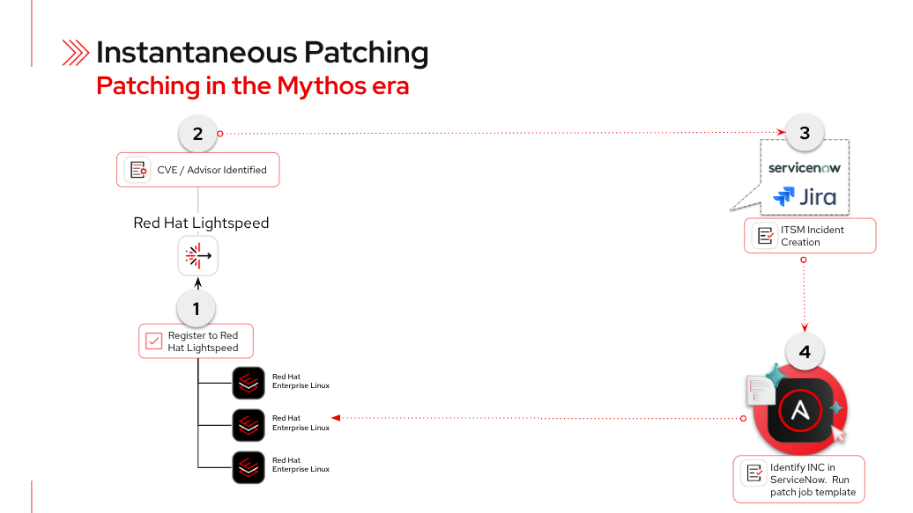

# aap.lightspeed.patching

> **Instantaneous Patching — Patching in the Mythos era**

Automated, AI-assisted patching workflow combining **Red Hat Lightspeed**,
**Ansible Automation Platform (AAP)**, and **Event-Driven Ansible (EDA)** to
identify, remediate, and record CVEs and advisories — with full ITSM integration.

---

## Architecture



```
1. RHEL systems register to Red Hat Lightspeed
2. CVE / Advisor identified by Lightspeed
3. AAP runs patch job template against affected hosts
4. ITSM Change Request created and updated (ServiceNow)
```

---

## Integrations

| Category | Tools |
|----------|-------|
| AI / Advisory | Red Hat Lightspeed |
| Automation | Ansible Automation Platform (AAP), Event-Driven Ansible |
| Patching Target | Red Hat Enterprise Linux (RHEL) |
| ITSM | ServiceNow |

---

## The provisioned host

Every RHEL host provisioned and patched by this workflow gets a Red Hat
Lightspeed login banner, installed by
[`playbooks/configure_motd.yml`](playbooks/configure_motd.yml):

```text
        ___________________________________________________________________
       /                                                                   \
      |    ____  _____ ____    _   _    _  _____                            |
      |   |  _ \| ____|  _ \  | | | |  / \|_   _|                           |
      |   | |_) |  _| | | | | | |_| | / _ \ | |                             |
      |   |  _ <| |___| |_| | |  _  |/ ___ \| |                             |
      |   |_| \_\_____|____/  |_| |_/_/   \_\_|                             |
      |                                                                     |
      |   _     ___ ____ _   _ _____ ____  ____  _____ _____ ____           |
      |  | |   |_ _/ ___| | | |_   _/ ___||  _ \| ____| ____|  _ \          |
      |  | |    | | |  _| |_| | | | \___ \| |_) |  _| |  _| | | | |         |
      |  | |___ | | |_| |  _  | | |  ___) |  __/| |___| |___| |_| |         |
      |  |_____|___\____|_| |_| |_| |____/|_|   |_____|_____|____/          |
      |                                                                     |
      |         =============================================               |
      |          C V E   P A T C H I N G   E N G I N E                      |
      |         =============================================               |
      |                                                                     |
      |   Powered by:                                                       |
      |     - Red Hat Insights            (detect)                          |
      |     - Event-Driven Ansible        (respond)                         |
      |     - Ansible Automation Platform (remediate)                       |
      |     - ServiceNow ITSM             (track)                           |
      |                                                                     |
      |   This host is managed by AAP. Manual changes may be reverted.      |
       \___________________________________________________________________/
              \
               \   ^__^
                \  (oo)\_______
                   (__)\       )\/\
                       ||----w |
                       ||     ||
```

---

## Prerequisites

- Ansible Automation Platform 2.4+
- Red Hat Lightspeed subscription
- RHEL hosts registered to Red Hat Insights
- `~/.ansible.cfg` configured with Automation Hub token (see `ansible.cfg.example`)

---

## Quick Start

```bash
git clone https://github.com/toharris-rh/aap.lightspeed.patching.git
cd aap.lightspeed.patching
cp ansible.cfg.example ~/.ansible.cfg
# Edit ~/.ansible.cfg — replace REPLACE_ME_AUTOMATION_HUB_OFFLINE_TOKEN
# with your token from https://console.redhat.com/ansible/automation-hub/token
```

See [CONTRIBUTING.md](CONTRIBUTING.md) for development setup and
[docs/servicenow-integration.md](docs/servicenow-integration.md) for the
full ITSM integration guide.

---

## License

[MIT](LICENSE)
