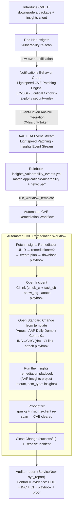

# Demo Talk Track — Auditable Automated CVE Remediation

**Audience:** security, ops, and GRC/audit stakeholders
**Target runtime:** 8–12 minutes
**The one-liner:** *"A critical CVE appears on a server, and with zero human ITSM
work, Red Hat Insights detects it, Ansible opens the tickets, applies the
Red Hat-authored fix, proves it's gone, and leaves an auditor-verifiable trail."*

This is the **Phase 11** evolution of ACT 2 (see [ROADMAP.md](../ROADMAP.md)),
using the **native Red Hat Insights → Event-Driven Ansible** path and adding a
full **auditable ServiceNow control trail** (issue
[#84](https://github.com/toharris-rh/aap.lightspeed.patching/issues/84)).

---

## Architecture

**Why each hop matters**
- **Insights → EDA (native):** the certified `redhat.insights_eda` integration; no
  glue. Insights pushes the CVE event the moment it crosses a threshold.
- **Standard Change from a pre-approved template:** the change is *pre-approved*
  (no CAB wait) and its plan fields *are* the IT control document ("Control01").
- **Insights-authored playbook:** the fix is Red Hat's own remediation, attached to
  both tickets and run via the native Insights project mount.
- **Proof of fix:** the same Insights service that flagged the CVE confirms it's gone.
- **One advisory, many CVEs:** a single package issue surfaces a batch of CVEs all
  fixed by one RHSA — one Standard Change clears them all.

---

## Pre-flight checklist (do before the audience is watching)

- [ ] Demo VM provisioned, registered with Insights, and **fully patched** — its
      Insights **Vulnerability tab reads 0** (the post-patch `insights-client`
      refresh ran; see PR #86). A clean baseline is essential.
- [ ] EDA: the **Insights Event Stream** exists and the **rulebook activation** is
      Running; the stream is **out of test mode** with *Forward events to rulebook
      activation* ON.
- [ ] console.redhat.com → Notifications: the **"Lightspeed CVE Patching Engine"**
      behavior group routes the vulnerability `new-cve-*` events → the **Event-Driven
      Ansible** integration.
- [ ] ServiceNow: the **"Ames - AAP Daily Demo"** Standard Change Template (Control01)
      exists; no leftover INC/CHG from a prior run.
- [ ] Browser tabs: Insights Vulnerability, AAP (workflow visualizer), ServiceNow.

---

## The demo (beat by beat)

### 1. The clean baseline (30s)
> "This is a production RHEL server, fully patched. Red Hat Insights shows **zero**
> outstanding vulnerabilities. This is our compliant baseline."

*Show:* Insights → Inventory → the host → **Vulnerability** tab → empty.

### 2. A vulnerability appears (1 min)
> "Now something changes — a package drifts to a vulnerable version. In the real
> world that's a bad install, a rollback, a supply-chain issue. Watch."

*Show:* run the **Introduce CVE** job (openssl). Within ~1 minute Insights detects a
batch of CVEs — headline **CVE-2026-45445, CVSS 9.1** — all fixed by one advisory,
all **Remediation type: Playbook**.

### 3. Insights fires the event — automation takes over (1 min)
> "No human filed a ticket. Insights notified Event-Driven Ansible the instant the
> CVE crossed our severity threshold."

*Show:* AAP → the **Automated CVE Remediation** workflow launching itself; the EDA
event stream's received-event count ticking up.

### 4. The ITSM trail builds itself (2–3 min)
> "Ansible is now doing what your change process requires — but in seconds."

*Show, in ServiceNow:*
- An **Incident** documenting the CVE, linked to the server CI, with live work notes.
- A **pre-approved Standard Change** created from our template — its plan fields are
  the control document ("Control01"), the Incident is linked, and **the exact
  Red Hat remediation playbook is attached** to both tickets.

### 5. The fix + the proof (2 min)
> "It runs Red Hat's own remediation playbook — not something we hand-wrote — and
> then it *proves* the fix using the same source that found the problem."

*Show:* the remediation runs; then the host's Insights Vulnerability tab returns to
**0**, and that evidence is attached to the change. The Change closes *successful*;
the Incident resolves.

### 6. The auditor's view (1 min)
> "Here's what your auditor opens. One report. Every CVE remediation, the
> pre-approved control it ran under, the server, the playbook that ran, and the
> proof it worked — with timestamps. Control01, satisfied, automatically."

*Show:* the ServiceNow **sys_report** filtered to Control01.

### Close (30s)
> "Detection to documented, audited, proven remediation — with no human touching
> the ITSM system. That's the difference between *knowing* you have a vulnerability
> and *having already fixed it under change control*."

---

## The control / audit story (for GRC stakeholders)

- **Control statement (Control01):** *"Automatically remediate the vulnerabilities
  found by Red Hat Insights on a related server using Ansible."*
- **Pre-approved Standard Change** = no CAB delay, but full change-management rigor:
  Implementation / Test / Backout plans are pre-documented on the template.
- **Evidence retained on the record:** CVE detail, the Insights-authored playbook
  (attached), and proof-of-fix (Insights "CVE cleared").
- **Bidirectional traceability:** server CI ↔ Incident and ↔ Change; Incident ↔ Change.
- **The auditor verifies via a single ServiceNow report**, not a screen-share.

---

## Screenshots to capture (save to `docs/images/`)

Already captured this session (reuse):
- EDA integration test success (console Event Log, green).
- Clean baseline (Vulnerability tab, 0 CVEs) **and** post-introduce (16 CVEs, one RHSA).
- The "Lightspeed CVE Patching Engine" behavior group.

Capture once the workflow is built (Slices 3–7):
- `cve-remediation-incident.png` — the Incident with CVE detail + attached playbook.
- `cve-remediation-standard-change.png` — the Standard Change (Control01) + plans + links.
- `cve-remediation-proof.png` — Vulnerability tab back to 0 after remediation.
- `cve-remediation-auditor-report.png` — the ServiceNow Control01 evidence report.

---

## Build status (as of 2026-06-15)

Live today: clean baseline + post-patch Insights refresh (#86), the native
Insights→EDA trigger + event stream (#85), and Insights remediation-plan creation
(Slice 2). **In progress** (issue #84): the remediation workflow itself — Incident,
Standard Change from template, run via the Insights project mount, proof-of-fix,
and the auditor report (Slices 3–7). This talk track describes the full intended
flow; beats 4–6 light up as those slices land.
