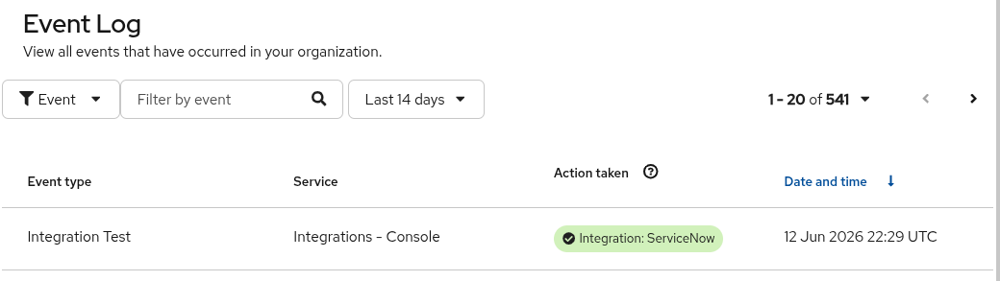

# Native Red Hat Insights → ServiceNow Integration (as-built)

This documents the **native** integration path: Red Hat Insights / Lightspeed
sends events **directly** into ServiceNow via the certified
[*Flow Templates for Red Hat Insights*](https://store.servicenow.com/store/app/0ddea32e1b646a50a85b16db234bcb58)
ServiceNow app — **no AAP/EDA in the middle**.

> This is distinct from the **EDA path** in
> [`docs/servicenow-integration.md`](servicenow-integration.md), where Insights
> events flow through AAP EDA and ServiceNow is written by playbooks. The two
> can coexist. Pick the path that matches what you're demoing.

```
Red Hat Insights / Lightspeed (each SE's own org)
  → console.redhat.com "ServiceNow" integration (Endpoint URL + Secret token)
  → ServiceNow scripted REST endpoint (Flow Templates for Red Hat Insights app)
  → ServiceNow records (incidents / flows)
```

---

## ⚠️ Key fact: ONE fixed integration user, ONE shared secret

The app authenticates **every** inbound Hybrid Cloud Console call as a **single
fixed ServiceNow user named `rh_insights_integration`**. That is why the console
"Add integration" wizard asks only for a **Secret token** and **no username** —
the username is hard-coded by the app, and the Secret token is simply that
user's **password**.

Consequences:

- There is exactly **one** integration user (`rh_insights_integration`) and
  **one** shared secret token (its password).
- **Every SE's** console integration uses the **same** Endpoint URL and the
  **same** Secret token. You **cannot** give each SE a distinct ServiceNow user
  or secret with this app — inbound calls always authenticate as
  `rh_insights_integration`.
- If `rh_insights_integration` is missing or its password doesn't match the
  Secret token, the ServiceNow system log fills with
  `Basic authentication failed for user: rh_insights_integration`.

---

## What is already in place (instance-wide)

Done once per ServiceNow instance — verified 2026-06-12:

| Item | State |
|------|-------|
| App: **Flow Templates for Red Hat Insights** (`x_rhtpp_rh_webhook` v1.0.9) | Installed & active |
| Role used by the integration user | `x_rhtpp_rh_webhook.rest` |
| REST endpoint | `…/api/x_rhtpp_rh_webhook/flow_templates_for_red_hat_insights` (POST-only) |
| Integration user | `rh_insights_integration` exists with `x_rhtpp_rh_webhook.rest` (**password set in the UI — see below**) |

The instance hostname and admin API credentials live only in the gitignored
`docs/dev-environment.sh` (`SN_HOST`, `SN_USERNAME`, `SN_PASSWORD`).

---

## ⚠️ Manual steps to finish & test

Two things **cannot** be automated from this repo.

### 1. Set the `rh_insights_integration` password (ServiceNow UI, once)

`user_password` writes over the ServiceNow REST API are **silently ignored on
this instance** (the call returns HTTP 200 but the password is not set). So an
admin sets it in the UI:

1. Sign in to `https://<instance>.service-now.com` as an admin.
2. **User Administration → Users** → open **`rh_insights_integration`**.
3. **Set Password** related link → choose a strong password → save.

**That password is the shared Secret token** for every SE's console integration.
Whoever owns it distributes it to the SEs over a secure channel (it is *not*
stored in this repo).

### 2. Add the integration in each SE's Hybrid Cloud Console

Done in **each SE's own** `console.redhat.com` (their Red Hat org), all using the
same values:

| Field | Value |
|-------|-------|
| Integration name | e.g. `ServiceNow – Patching` |
| Endpoint URL | `https://<instance>.service-now.com/api/x_rhtpp_rh_webhook/flow_templates_for_red_hat_insights` |
| Secret token | the `rh_insights_integration` password from step 1 |

Then **Associate event types** (advisories / vulnerabilities) → **Review → Submit.**
(SSL verification stays enabled.)

### 3. Test

In the console integration, use **Test** (or trigger a real advisory). A
successful run shows in the Hybrid Cloud Console **Event Log** as an
*Integration Test* event with **Action taken: Integration: ServiceNow** and a
green check:



Then confirm the corresponding record lands in ServiceNow. To debug a failure,
check the ServiceNow **System Log** — a missing user or mismatched secret shows
as `Basic authentication failed for user: rh_insights_integration`.

---

## ⚠️ Shared-instance caveat — no per-org isolation

This ServiceNow instance is shared by ~33 SEs, and (per the section above) all
SEs authenticate as the **same** `rh_insights_integration` user. Every SE's
events land in the **same** ServiceNow tables with no automatic separation by
Red Hat org. The inbound payload carries the Red Hat org/account ID, so
segregate with a custom field, a per-SE assignment group, or a filter **before**
this gets busy.

---

## Rollback / cleanup

- **Do not delete `rh_insights_integration`** — it is the one account the app
  requires. Deleting it breaks every SE's integration.
- Removing the app instance-wide affects everyone — coordinate first.

> **History:** an earlier revision of this doc described a per-SE-user model
> (distinct ServiceNow users + secrets per SE). That was **incorrect** for this
> app — inbound auth is always `rh_insights_integration` — and has been
> corrected here. The stray per-SE users have been removed.
