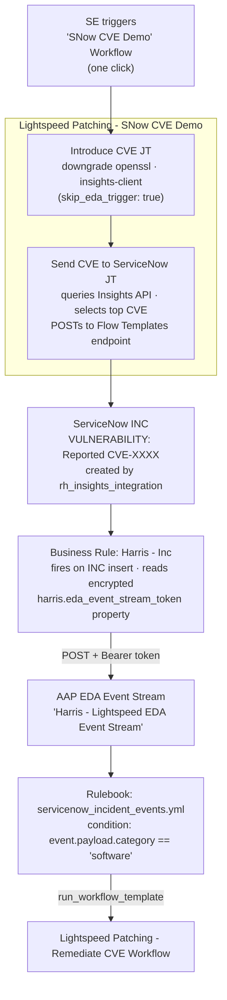

# Demo Talk Track — ServiceNow-Driven CVE Remediation

**Audience:** SEs and architects
**Target runtime:** 5–8 minutes
**The one-liner:** *"One workflow trigger introduces a vulnerability, sends it
to ServiceNow, and hands off to Event-Driven Ansible — showing how ITSM and
automation operate as a closed loop without any human dispatch."*

This is the **ServiceNow-first** variant of the CVE remediation demo. Rather
than waiting for the native Red Hat Insights notification sweep (non-deterministic,
~daily), a single AAP workflow both stages the CVE and drives it into the ITSM
system immediately. EDA then closes the loop automatically.

---

## Architecture



**Why each hop matters**

- **Single workflow trigger:** the SE runs one thing. Introduce CVE and Send CVE
  to ServiceNow are chained nodes — the audience sees a clean end-to-end chain,
  not two manual steps.
- **`skip_eda_trigger: true` on Introduce CVE:** the JT only downgrades the
  package and runs `insights-client`. It does *not* self-POST to the Insights
  EDA event stream. The intent here is to let ServiceNow own the event entry
  point, not Insights.
- **Send CVE to ServiceNow:** queries the Insights vulnerability API for the
  real CVE on the host, crafts a payload matching the native Insights format,
  and POSTs directly to ServiceNow. This bypasses the one-per-CVE-per-account
  deduplication so the demo can be re-run on any fresh VM.
- **ServiceNow Business Rule:** the "Harris - Inc" rule fires on every INC
  insert, reads the encrypted `harris.eda_event_stream_token` system property,
  and POSTs the incident payload to the AAP EDA event stream. No token is
  stored in plain text.
- **EDA → remediation:** the rulebook matches and fires the remediation workflow
  automatically.

---

## Pre-flight checklist (do before the audience is watching)

- [ ] Demo VM provisioned, registered with Insights, and **fully patched**
      (Insights Vulnerability tab reads 0).
- [ ] AAP EDA: **"Lightspeed Patching - Catch SNow Incidents"** activation is
      **Running** and *Forward events to rulebook activation* is **ON**.
- [ ] ServiceNow: **"Harris - Inc"** Business Rule is **Active**.
- [ ] ServiceNow: **`harris.eda_event_stream_token`** system property is set
      (type: password, value matches the AAP EDA event stream bearer token).
- [ ] No leftover INCs from a prior run — the Business Rule fires on INC
      **insert**, not update. Delete any open INC before re-running.
- [ ] Browser tabs: AAP (workflow visualizer), ServiceNow (INC list), AAP EDA
      (event stream "Events received" counter).

---

## The demo (beat by beat)

### 1. The clean baseline (30 s)

> "This server is fully patched. Red Hat Insights shows zero outstanding
> vulnerabilities. ServiceNow has no open incidents for this host. Clean slate."

*Show:* Insights → the host → Vulnerability tab (empty). ServiceNow INC list
filtered to the host (empty).

---

### 2. One trigger, full chain (2–3 min)

> "I'm going to fire a single workflow. Watch what happens — no human will
> touch the ticketing system."

*Run:* **Lightspeed Patching - SNow CVE Demo** workflow in AAP.

*While it runs, narrate each node as it lights up:*

- **Introduce CVE** — "This downgrades a package to a version with a known
  vulnerability. `insights-client` uploads the new state to Red Hat Insights.
  The CVE is real — you can pull up the Insights console and see it."
- **Send CVE to ServiceNow** — "This queries the Insights vulnerability API for
  the highest-severity CVE on the host, crafts a payload in the exact format
  the native Insights integration uses, and POSTs it to ServiceNow. We bypass
  the native notification sweep — which only fires once per CVE per account —
  so we can reproduce this on any fresh VM."

*Show:* ServiceNow INC list refreshes — a new **VULNERABILITY: Reported
CVE-XXXX** incident appears, created by **rh_insights_integration**.

> "The ticket is open. But here's the part no human triggered — watch the
> event stream."

*Show:* AAP EDA → "Harris - Lightspeed EDA Event Stream" — **Events received**
counter increments.

> "ServiceNow's Business Rule read the incident, pulled the bearer token from an
> encrypted system property, and notified Ansible's event bus. EDA matched on the
> payload and launched the remediation workflow."

---

### 3. EDA fires remediation (1–2 min)

> "The workflow is running itself. Ansible is doing what your runbook says to do
> — but in seconds, with full audit trail."

*Show:* **Lightspeed Patching - Remediate CVE Workflow** launching in AAP.
Narrate the remediation steps as they run.

---

## The technical wiring (for architects)

| Component | Detail |
|-----------|--------|
| **Introduce CVE JT** | `skip_eda_trigger: true` — only downgrades + insights-client; no self-POST to Insights EDA stream |
| **Send CVE to ServiceNow JT** | Queries `/api/vulnerability/v1/systems/<uuid>/cves`; prefers `known_exploit=true`, falls back to highest CVSS; posts to `/api/x_rhtpp_rh_webhook/flow_templates_for_red_hat_insights` |
| **Business Rule** | `Harris - Inc` · table: `incident` · condition: insert · reads `harris.eda_event_stream_token` (password-type property) via `gs.getProperty()` |
| **EDA rulebook** | `rulebooks/servicenow_incident_events.yml` · condition: `event.payload.category == "software"` (verify this matches INC category on your instance) |
| **Remediation workflow** | `Lightspeed Patching - Remediate CVE Workflow` |

**Note on the rulebook condition:** the category field is set by the Business
Rule from `current.category.getDisplayValue()`. Verify on your ServiceNow instance
that Insights-created INCs have `category = Software`. If not, update the
condition in the rulebook to match the actual value.

---

## Reproduce / reset

```bash
# After the demo, delete the INC so the Business Rule can fire again on the
# next run (it fires on INSERT, not UPDATE).
# Do this in ServiceNow: INC list → delete the VULNERABILITY INC.
# Or via the API:
source docs/dev-environment.sh
INC_SYS_ID=$(curl -s -u "$SN_USERNAME:$SN_PASSWORD" \
  "$SN_HOST/api/now/table/incident?sysparm_query=caller_id.user_name=rh_insights_integration^stateNOT IN6,7&sysparm_fields=sys_id&sysparm_limit=1" \
  | python3 -c "import json,sys; print(json.load(sys.stdin)['result'][0]['sys_id'])")
curl -s -o /dev/null -w "DELETE: %{http_code}\n" -u "$SN_USERNAME:$SN_PASSWORD" \
  -X DELETE "$SN_HOST/api/now/table/incident/$INC_SYS_ID"
```

Then re-run the **Lightspeed Patching - SNow CVE Demo** workflow.

---

## Comparison to the Insights-native path

| | SNow CVE Demo (this doc) | Insights-native path |
|---|---|---|
| **Trigger** | One AAP workflow | One AAP JT (Introduce CVE) |
| **Event entry point** | ServiceNow INC → Business Rule → EDA | Insights notification → EDA |
| **ITSM ticket timing** | Immediate (part of the workflow) | Immediate (workflow creates INC) |
| **Re-runnable** | Yes — delete INC, re-run | Yes — self-POST bypasses Insights sweep |
| **Talk track angle** | ITSM as the automation trigger | Insights as the security scanner |
| **Best for** | Customers heavy on ITSM-first workflows | Customers focused on Insights/vulnerability management |
